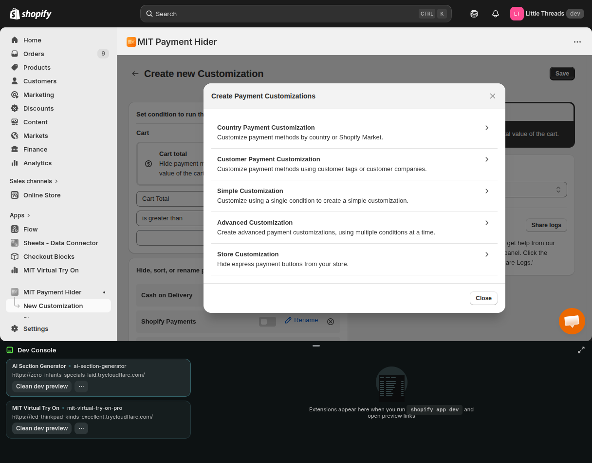
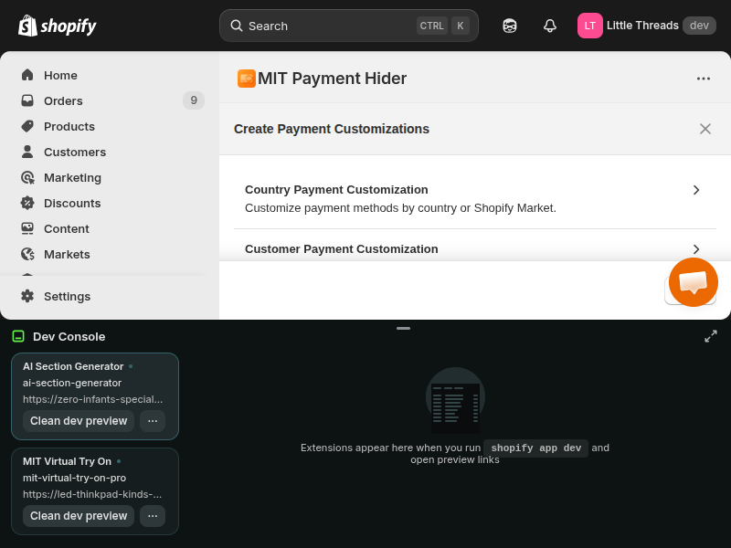

# How to Hide COD for Guest Customers in Shopify?

**Author:** Ferb
**App:** Hide, Sort, Rename Payment Methods
**Topic:** Hiding Cash on Delivery (COD) for Guest Users to reduce RTO.

---

## Meta Data
- **Title:** How to Hide COD for Guest Customers in Shopify? | Reduce RTO
- **Meta Description:** Learn how to easily hide Cash on Delivery (COD) for guest customers in your Shopify store using the "Hide, Sort, Rename Payment Methods" app. Reduce return rates and encourage prepaid orders.
- **Slug:** `how-to-hide-cod-guest-customers-shopify`
- **Keywords:** hide cod shopify, disable cash on delivery guest checkout, shopify payment rules, reduce rto shopify, hide payment methods app

---

## 1. Introduction

Running an e-commerce store is a balancing act. On one hand, you want to make checkout as frictionless as possible—which is why **Guest Checkout** is so popular. It lets customers buy quickly without the hassle of creating an account.

On the other hand, you have **Cash on Delivery (COD)**. In many markets, COD is essential for trust, accounting for over 60% of orders in countries like India.

But when you combine **Guest Checkout + COD**, you create a perfect storm for **RTO (Return to Origin)**.

Why? Because guest users have zero "skin in the game." They haven't verified their email, they have no order history, and they can easily place an impulse order with fake details. Industry data suggests that **guest COD orders have an RTO rate of 35-50%**, compared to just 10-15% for logged-in customers.

Every RTO hits your bottom line hard. You pay for forward shipping, reverse shipping, packaging, and risk damage to the product—often losing **₹80-150 ($1-2)** per failed order.

**The Solution:** You don't need to disable COD entirely. You just need to be smarter about *who* sees it.

In this guide, I'll show you how to use the **Hide, Sort, Rename Payment Methods** app to automatically **hide COD for guest customers** while keeping it available for your trusted, logged-in users.

## 2. Understanding Guest Checkout & RTO Risks

Before we dive into the setup, let's understand why **Guest Checkout** is a double-edged sword for COD.

A "Guest Customer" in Shopify is someone who checks out without creating an account or logging in. They provide an email and shipping address, but their identity is unverified.
-   **No Friction:** Great for prepaid orders (impulse buys).
-   **No Verification:** Dangerous for COD orders.

Because there's no commitment, guests are statistically more likely to refuse delivery or provide a fake address. By forcing account creation for COD, you add a layer of friction that filters out non-serious buyers while capturing valuable customer data (email/phone) for future marketing.

## 3. Prerequisites

To implement this strategy, you'll need:
1.  **A Shopify Store:** Active and running.
2.  **Cash on Delivery (COD):** Enabled in your Payment settings.
3.  **Hide, Sort, Rename Payment Methods App:** This app gives you the conditional logic Shopify lacks natively.
    *   [Install the App Here](https://apps.shopify.com/hide-sort-rename-payment-methods)

## 4. Step-by-Step Guide: How to Hide COD for Guest Customers

Here's how to configure the **Hide, Sort, Rename Payment Methods** app to target only guest users. This process takes less than 2 minutes.

**Step 1: Install the App**
Search for **"Hide, Sort, Rename Payment Methods"** on the Shopify App Store and click **Install**. Approve the permissions to connect it to your store.

**Step 2: Access the Dashboard**
From your Shopify Admin, go to **Apps** and select **Hide, Sort, Rename Payment Methods**.

**Step 3: Create a New "Hide" Rule**
On the main dashboard, click on the **Create New Rule** button. Select **"Hide Payment Methods"** as your action type.

**Step 4: Select Your Target Method**
In the "Payment Method" dropdown, search for and select **"Cash on Delivery (COD)"**. If you've renamed it manually (e.g., "Pay on Delivery"), select that name.

**Step 5: Define the Condition**
This is the critical step. We need to tell the app *when* to hide COD.
1.  Under **Condition Type**, select **"Customer"**.
2.  Choose the rule logic: **"Is Guest"** (or sometimes labeled as "Not Logged In").
3.  Ensure the operator is set to **Yes/True**.

**Step 6: Save and Activate**
Review your rule. It should read something like:
> *Hide [Cash on Delivery] IF [Customer is Guest]*

Click **Save Rule** and ensure the status toggle is set to **Active**.

**Step 7: Test the Rule**
Never go live without testing!
1.  Open your store in an **Incognito/Private window** (this simulates a guest user).
2.  Add a product to cart and go to checkout.
3.  **Verify:** You should NOT see "Cash on Delivery" as an option.
4.  Now, **Log in** to your customer account in a normal window.
5.  **Verify:** "Cash on Delivery" should reappear.

## 5. Alternative Approaches (Advanced)

Hiding COD entirely for guests is effective, but it might be too aggressive for some stores. The app allows for more nuanced rules:

**A. Hide by Cart Value**
Maybe you trust guests with small orders but not large ones.
> *Hide [COD] IF [Customer is Guest] AND [Cart Total > $50]*

This protects you from high-value losses while still capturing smaller impulse buys.

**B. Hide by Product Tag**
If you sell high-risk items (e.g., electronics, jewelry), you can restrict COD for those specific products when a guest is buying.
> *Hide [COD] IF [Product Tag contains 'High-Risk'] AND [Customer is Guest]*

**C. Hide by Location (Pin Code)**
If you know certain regions have high RTO rates, you can blacklist them for guest COD.
> *Hide [COD] IF [Shipping Zip Code starts with '110'] AND [Customer is Guest]*

## 6. Best Practices

Hiding COD for guests works, but communication is key to avoid frustration.
1.  **Banner Message:** Use a cart banner (or the app's message feature if available) to say: *"Login to unlock Cash on Delivery + Free Shipping!"*
2.  **Incentivize:** Give a small discount (5%) for prepaid orders to make them more attractive than COD.
3.  **Don't Block Everything:** Ensure guests always have at least one payment option (Credit Card/PayPal) so they don't hit a dead end.

## 7. FAQ

**Q: Will this disable guest checkout entirely?**
A: No, guest checkout remains active. Guests can still pay using Credit Cards, PayPal, or other prepaid methods. Only COD is hidden.

**Q: Can logged-in users still see COD?**
A: Yes! The rule only targets guests. Your loyal, logged-in customers will experience no change.

**Q: What if a guest really wants to use COD?**
A: They simply need to create an account or log in. This takes less than 30 seconds and helps you build your customer database.

**Q: Does this work on Shopify Plus?**
A: Yes, the app is compatible with Shopify Plus and checkout extensibility.

## 8. Conclusion

By hiding COD for guest customers, you solve the RTO problem at its source. You filter out low-intent buyers while nudging serious customers to create an account—building your email list and long-term value.

Ready to secure your checkout?
👉 **Install Hide, Sort, Rename Payment Methods Today**
