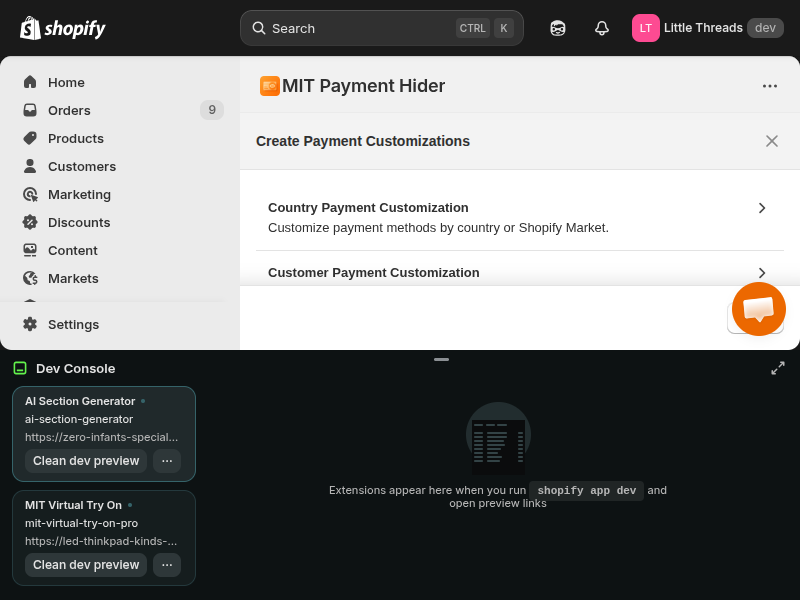

# How to Rename a Payment Method in Shopify?

**Meta Title:** How to Rename a Payment Method in Shopify? [Complete Guide 2026]

**Meta Description:** Learn how to rename payment methods in Shopify checkout to improve customer trust and clarity. Step-by-step guide with screenshots using MIT Payment Hider app.

**Target Keyword:** Rename payment method in Shopify

**Target Audience:** Shopify store owners, e-commerce managers

---

## 1. Introduction

Your checkout page is where sales happen—or die.

You've spent weeks optimizing your product pages, perfecting your ads, and driving traffic to your store. But when customers reach checkout and see **"Manual Payment"** or **"Gateway 47"**, confusion sets in. They hesitate. They abandon.

**Generic payment method names are conversion killers.**

The problem? Shopify locks you into provider-default names. You can't rename "Cash on Delivery" to "COD - ₹50 fee applies" to manage expectations. You can't change "Credit Card" to "Pay by Card - Same Day Shipping" to create urgency.

**Until now.**

In this guide, I'll show you how to **rename any payment method in Shopify**—from manual methods to third-party gateways—using the **MIT Payment Hider** app. You'll learn to add fees, discounts, localize for different markets, and make your checkout crystal clear.

Let's turn confusion into conversions.

---

## 2. Why Rename Payment Methods in Shopify?

Renaming isn't just cosmetic—it's strategic. Here's why it matters:

### 2.1 Improve Customer Clarity

**The Problem:**
A customer sees "Manual Payment" at checkout. What does that mean? Bank transfer? Check? Cash? They don't know, so they bounce.

**The Fix:**
Rename it to **"Bank Transfer (NEFT/IMPS)"**—instant clarity. No guesswork.

**Result:** Lower cart abandonment from confusion. Customers pick the method they understand.

### 2.2 Add Marketing Messages

Payment method names are valuable real estate. Use them to:
- **Disclose fees upfront:** "COD - ₹50 delivery fee"
- **Highlight discounts:** "UPI - Get 3% cashback instantly"
- **Create urgency:** "Express Checkout - Ships Today"

**Example:** An Indian fashion brand renamed COD to **"COD - ₹75 fee (Free above ₹999)"**. Cart abandonment dropped 12% because customers knew exactly what to expect.

### 2.3 Match Your Brand Voice

If your brand is fun and casual, "Tap to Pay 💳" hits different than "Credit Card Payment."

If you're targeting French customers, **"Carte Bancaire"** feels more trustworthy than "Credit Card."

**Localization matters.** Shopify Markets makes this easy—but only if you can rename payment methods by language.

### 2.4 Highlight Benefits or Restrictions

Use renaming to nudge behavior:
- **"EMI Available - 0% Interest"** (builds trust for big-ticket items)
- **"COD - Registered Customers Only"** (encourages account creation)
- **"PayPal - Buyer Protection Included"** (reduces anxiety)

Your payment method names can sell just as hard as your product copy.

---

## 3. Can You Rename Payment Methods in Shopify by Default?

**Short answer:** Only some. And with major limitations.

### 3.1 Shopify's Native Limitations

Shopify lets you rename **manual payment methods** like Bank Deposit or Cash on Delivery in your Payment Settings. But you **cannot** rename:

- **Third-party gateways** (Stripe, PayPal, Razorpay, Mollie, etc.)
- **Dynamic checkout buttons** (Shop Pay, Apple Pay, Google Pay)
- **Payment methods conditionally** (show "COD" to some customers, "Pay on Delivery" to others)

**Why the restriction?**
Third-party gateways control their own branding. Shopify doesn't give you edit access to protect consistency and prevent fraud.

**The workaround?**
You need an app that hooks into Shopify's Checkout Extensibility API.

### 3.2 Why You Need an App

MIT Payment Hider uses **Shopify Functions** (the official extension framework) to:
- Rename **any** payment method—manual or third-party
- Apply renames **conditionally** based on:
  - Customer location (country, zip code)
  - Customer tags or login status
  - Cart value or specific products
  - Language/locale (perfect for Shopify Markets)
  - Day of the week or time

**Example use case:**
Show **"Carte Bancaire"** to French-speaking customers and **"Credit Card"** to English speakers—same gateway, different branding.

Native Shopify can't do this. MIT Payment Hider can.

---

## 4. How to Rename Payment Methods Using MIT Payment Hider App

Here's the exact process. Takes under 5 minutes.

### Step 1: Install MIT Payment Hider App

1. Visit the [Shopify App Store](https://apps.shopify.com/hide-sort-rename-payment-methods)
2. Search for **"MIT Payment Hider"** or **"Hide, Sort, Rename Payment Methods"**
3. Click **Add app** and authorize it in your Shopify Admin
4. Once installed, open the app from **Apps > MIT Payment Hider**

*The MIT Payment Hider app dashboard in Shopify Admin*

### Step 2: Create a New Customization Rule

1. In the app dashboard, click **Create New Rule** (or similar button)
2. Select **"Rename Payment Method"** as your action type
3. Give your rule a descriptive name (e.g., "Rename COD to show fee")

*Click "Create New Customization" and select your rule type from the modal*

### Step 3: Select the Payment Method to Rename

1. In the **Payment Method** dropdown, browse your active methods
2. Select the one you want to rename:
   - Cash on Delivery
   - Manual Payment
   - Stripe
   - PayPal
   - Any configured gateway

**Tip:** If you have multiple methods (e.g., "Credit Card via Stripe" and "Credit Card via Razorpay"), choose carefully.

*Select the payment method you want to rename from the dropdown list*

### Step 4: Enter the New Name

1. In the **Rename to** field, type your desired name
2. Follow these best practices:

**Keep it short and clear:**
- ✅ "COD - ₹50 fee"
- ❌ "Cash on Delivery (Delivery charges of ₹50 will be applied at the time of order placement)"

**Be honest:**
- ✅ "Bank Transfer - 2-3 day verification"
- ❌ "Instant Bank Transfer" (if it's not instant!)

**Add value when relevant:**
- ✅ "UPI - 3% cashback"
- ✅ "Card Payment - Same Day Dispatch"

**Character limit:** Aim for under 50 characters. Shopify checkout UI can handle ~80, but mobile screens truncate long names.

*Enter your custom payment method name in the rename field*

### Step 5: Set Conditions (Optional but Powerful!)

This is where MIT Payment Hider shines. You can rename payment methods **conditionally**.

**Examples:**

**By Location:**
- Show "COD - Free" for India
- Show "COD - $5 fee" for USA

**By Language/Locale** (killer for Shopify Markets!):
- French customers see: **"Carte Bancaire"**
- Spanish customers see: **"Tarjeta de Crédito"**
- English customers see: **"Credit Card"**

**By Customer Type:**
- Logged-in customers: "COD - Free Shipping"
- Guests: "COD - ₹75 fee"

**By Cart Value:**
- Cart < ₹500: "COD - ₹50 fee"
- Cart ≥ ₹500: "COD - Free!"

**To add a condition:**
1. Click **Add Condition**
2. Choose type: Location, Customer, Cart, Product, etc.
3. Set the logic (equals, contains, greater than, etc.)
4. Enter the value

*Use conditional rules to show different payment method names based on customer attributes, location, or language*

### Step 6: Save and Test

1. Click **Save Rule**
2. Ensure the rule is **Active** (toggle switch should be ON)
3. **Test immediately** (this is critical!):

**Testing Steps:**
1. Open your store in **Incognito/Private mode** (clears cache)
2. Add a product to cart
3. Go to checkout
4. **Verify the payment method shows your new name**

**If testing conditional rules:**
- Test with different customer accounts (logged in vs guest)
- Test from different locations (use VPN if needed)
- Test with different cart values

**Common issue:** Changes not showing?
- **Clear browser cache** (or use Incognito)
- **Check rule status** (make sure it's Active)
- **Verify app permissions** (Settings > Apps > MIT Payment Hider > Manage)

✅ If the new name appears correctly, you're done!

*Example: Transform generic "Manual Payment" into clear, actionable "Cash on Delivery - ₹50 Fee" to set customer expectations*

**Note:** The actual checkout appearance will show your custom payment method name exactly as entered, replacing the default provider name.

---

## 5. Best Practices for Renaming Payment Methods

Now that you know *how* to rename, here's how to do it *well*.

### 5.1 Be Clear and Honest

**Don't mislead customers.** If COD has a fee, say it upfront:
- ✅ "COD - ₹50 delivery fee"
- ❌ "Free COD" (when it's not free)

**Why it matters:** Hidden fees at final checkout cause abandonment. Transparency builds trust.

### 5.2 Keep It Concise

**Mobile matters.** Over 70% of e-commerce traffic is mobile. Long names get cut off:
- ✅ "Card - Same Day Ship"
- ❌ "Credit Card Payment with Same Day Shipping Available for Orders Placed Before 2 PM"

**Test on mobile view** before going live.

### 5.3 Test Across Devices

What looks great on desktop might break on mobile. Before launching:
- Test on **iPhone** (smaller screen)
- Test on **Android** (different browsers)
- Test on **tablet** (if your audience uses them)

Use Chrome DevTools (F12 > Toggle Device Toolbar) to simulate different screens.

### 5.4 Match Customer Language

**Localization isn't optional for global brands.**

If you sell in multiple countries, rename payment methods by locale:
- 🇫🇷 France: "Carte Bancaire" (not "Credit Card")
- 🇩🇪 Germany: "Kreditkarte"
- 🇮🇳 India: "UPI - तुरंत भुगतान" (instant payment in Hindi)

**Why it works:** Customers trust familiar terms. "Carte Bancaire" feels local; "Credit Card" feels foreign.

### 5.5 A/B Test Different Names

Don't guess—test.

**Example test:**
- **Version A:** "Cash on Delivery"
- **Version B:** "COD - ₹50 fee"

**Hypothesis:** Disclosing the fee upfront reduces abandonment because customers aren't surprised later.

**How to test:**
1. Run Version A for 1 week, track conversion rate
2. Run Version B for 1 week, track conversion rate
3. Keep the winner

**Tip:** Use Shopify Analytics or Google Analytics to measure checkout completion rates.

---

## 6. Common Use Cases and Examples

Here's how real stores use payment method renaming:

### 6.1 Adding Fees or Discounts

**Before:** "Cash on Delivery"
**After:** "COD - ₹50 Delivery Fee"

**Why it works:** Customers know the cost upfront. No surprises = fewer abandoned carts.

### 6.2 Highlighting Benefits

**Before:** "Manual Payment"
**After:** "Bank Transfer - Get 5% Cashback"

**Why it works:** Incentivizes a lower-cost payment method (bank transfer has no gateway fees).

### 6.3 Creating Urgency

**Before:** "Credit Card"
**After:** "Card Payment - Same Day Shipping"

**Why it works:** Urgency drives action. Customers who want fast shipping will choose this method.

### 6.4 Localization

**Before:** "UPI"
**After (Hindi):** "UPI - तुरंत पेमेंट" (Instant Payment)

**Why it works:** Local language builds trust. Shows you understand the market.

### 6.5 Clarifying Method Type

**Before:** "Manual Payment"
**After:** "NEFT/IMPS Bank Transfer"

**Why it works:** "Manual Payment" is vague. Customers don't know if it's check, wire, or something else. Clarity wins.

---

## 7. Troubleshooting Common Issues

### 7.1 Changes Not Showing at Checkout

**Possible causes:**
1. **Browser cache:** Use Incognito mode or hard refresh (Ctrl+Shift+R)
2. **Rule is disabled:** Check the toggle in the app—make sure it's ON
3. **App permissions missing:** Go to Settings > Apps > MIT Payment Hider > Verify checkout access

**Fix:** Clear cache first. If that doesn't work, verify the rule is Active and conditions are met.

### 7.2 Name Getting Cut Off on Mobile

**Problem:** You renamed "Credit Card" to "Credit Card Payment with Free EMI Available" and it's truncated on iPhone.

**Fix:**
- Shorten to **"Card - Free EMI"**
- Remove unnecessary words
- Test on actual mobile devices, not just desktop simulators

**Character guideline:** Keep it under 40 characters for mobile safety.

### 7.3 Multiple Payment Methods with Same Name

**Problem:** You have two "Credit Card" options (Stripe and Razorpay) and both show the same name after renaming.

**Fix:**
- Rename them differently: **"Card - Stripe"** and **"Card - Razorpay"**
- Or use conditions to show only one based on customer location

---

## 8. Advanced: Combining Rename with Hide/Sort Features

MIT Payment Hider doesn't just rename—it also **hides** and **reorders** payment methods. Combine them for maximum control.

### 8.1 Hide Payment Methods Based on Conditions

**Use case:** You want to hide COD for high-risk pin codes.

**Setup:**
1. Create a **Hide rule** for COD
2. Add condition: Shipping zip code starts with "110" (high RTO area)
3. Save and activate

**Result:** Customers in pin codes 110xxx won't see COD. Everyone else will.

**Bonus:** Combine with rename!
- For logged-in users in safe areas: Rename COD to "COD - Free"
- For everyone else: Hide it entirely

### 8.2 Reorder Payment Methods

**Use case:** You want UPI at the top (lowest gateway fees) and COD at the bottom (highest cost).

**Setup:**
1. Create a **Sort rule**
2. Drag payment methods into your preferred order
3. Save

**Result:** UPI appears first. More customers click it. You save on fees.

### 8.3 Create Complex Rules

**Advanced example:** Rename COD to "COD - ₹75 fee" **ONLY** for guest customers.

**Setup:**
1. Create **Rename rule** for COD
2. New name: "COD - ₹75 fee"
3. Add condition: Customer status = Guest
4. Save

**Result:**
- **Guests see:** "COD - ₹75 fee"
- **Logged-in users see:** "Cash on Delivery" (original name)

**Why it works:** You discourage guest COD orders (high RTO risk) without penalizing loyal customers.

**Combine cart value + customer tags + location** for ultra-targeted rules.

---

## 9. FAQ

**Q1: Can I rename payment methods without an app?**
**A:** Only manual payment methods (Bank Deposit, COD) in Shopify settings. You **cannot** rename third-party gateways like Stripe, PayPal, or Razorpay without an app.

**Q2: Will renaming affect payment processing?**
**A:** No. Renaming only changes the **display name** at checkout. The payment gateway, processing, and settlement remain exactly the same.

**Q3: Can I rename third-party payment gateways like Razorpay or PayPal?**
**A:** Yes! MIT Payment Hider supports **all payment methods** configured in your Shopify checkout, including third-party gateways and dynamic checkout buttons.

**Q4: Is there a character limit for payment method names?**
**A:** Shopify checkout UI can technically handle ~80 characters, but we **strongly recommend keeping it under 50** for readability—and under 40 for mobile screens.

**Q5: Can I show different names to different customers?**
**A:** Yes! Use **conditional rules** to rename based on:
- Customer tags or login status
- Location (country, region, zip code)
- Cart value or specific products
- Language/locale

**Example:** French customers see "Carte Bancaire"; English customers see "Credit Card."

**Q6: Does this work with Shopify Plus custom checkout?**
**A:** Yes. MIT Payment Hider uses Shopify Functions, which work on **standard Shopify and Shopify Plus** stores. It's fully compatible with Checkout Extensibility.

---

## 10. Conclusion

**Renaming payment methods is a small change with a big impact.**

Clear, honest, localized payment names reduce confusion, build trust, and improve conversions. Whether you're disclosing a COD fee upfront, highlighting a discount, or matching your brand voice, the right payment method names can turn hesitant browsers into confident buyers.

**Ready to optimize your checkout?**

👉 **[Install MIT Payment Hider](https://apps.shopify.com/hide-sort-rename-payment-methods)** and start customizing your payment methods today. Try it free for 14 days.

**Small tweaks. Big wins.**
